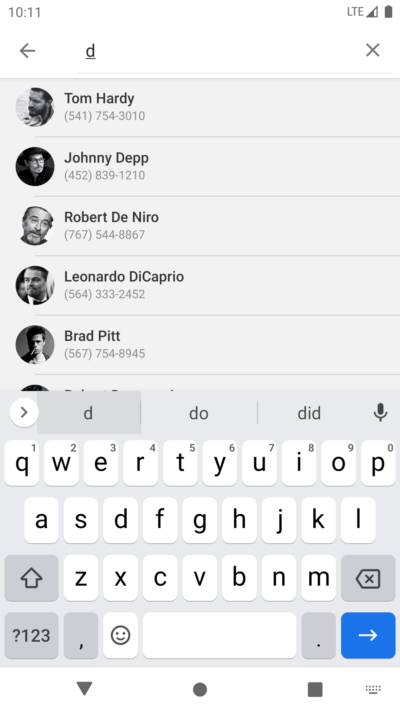

# Android-RecyclerView-adding-Search-Filter

 .
Earlier I have written few articles about RecyclerView. Combining it with CardView, cloning Gmail inbox, adding Swipe to delete functionality and bunch of other.

Today, in this article we are going to learn how to add search filter functionality to RecyclerView. Adding search is very simple task, we’ll use Toolbar’s search widget to input the search query. To demonstrate I am taking an example of contacts list and search for a contact by name or phone number.
